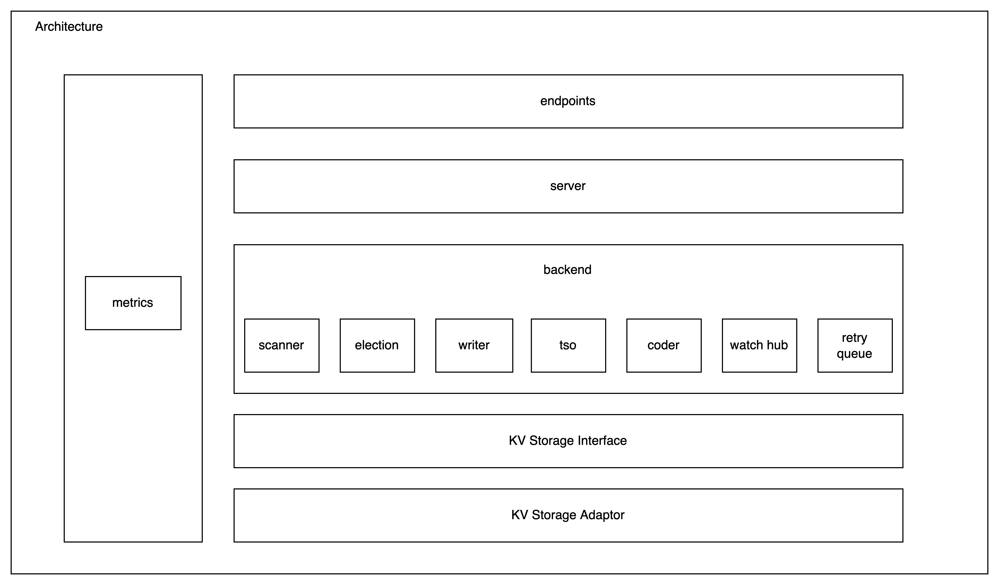
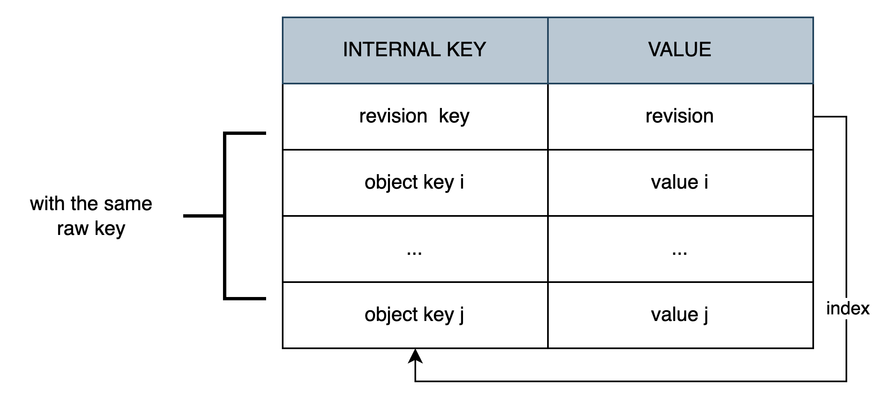
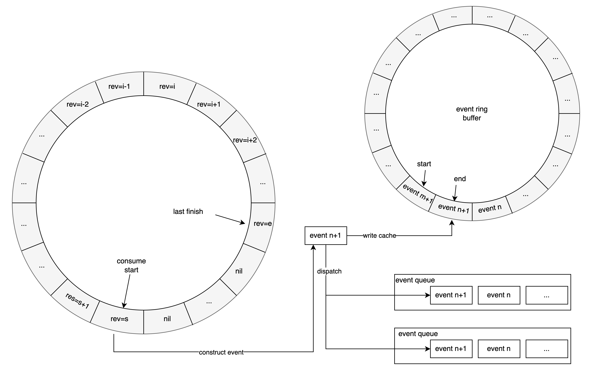

# 项目设计

## 项目概览

KubeBrain整体抽象了键值数据库的接口，在此基础上实现了API Server的storage接口，为K8S提供集群元数据存储服务。


## 内部架构


项目总体分成几个部分

- endpoints: 监听端口对外暴露服务
- server: RPC和HTTP逻辑封装
- backend: 元数据存储相关的逻辑封装
    - scanner：封装范围查找和垃圾回收相关的逻辑
    - election: 基于存储引擎提供的接口实现ResourceLock
    - writer: 负责写入数据
    - tso: 抽象出来的逻辑时钟组件，目前依赖于存储引擎的实现进行初始化，后续会解耦
    - coder: 进行Raw Key和Internal Key的相互转换
    - watch hub: 负责事件的生成、缓存和分发
    - retry queue: 异步重试队列，对于少量的返回非确定性错误的操作，通过异步重试修正保证最终一致性
- KV Storage Interface: 抽象出的KV存储引擎接口
- KV Storage Adaptor: KV存储引擎对于存储接口的实现，内置badger和TiKv的实现

### 数据模型

与etcd类似 KubeBrain 同样引入了 Revision 做版本管理，KubeBrain对于API Server输入的Raw Key会进行编码出两类Internal Key写入存储引擎索引和数据。对于每个
Key，索引Revision Key记录只有一条，当前 Raw Key 的最新版本号，同时也是一把锁，每次对 Raw Key 的更新操作需要对索引进行 CAS。数据记录Object Key有一到多条，每条数据记录了 Raw Key
的历史版本与版本对应的 Value。 Object Key的编码方式为`magic+raw_key+split_key+revision`

- `magic`为`\x57\xfb\x80\x8b`
- `raw_key`为实际API Server输入到存储系统中的Key
- `split_key`为`$`
- `revision`为逻辑时钟对写操作分配的逻辑操作序号通过BigEndian编码成的Bytes

> 根据 Kubernetes 的校验规则，raw_key 只能包含小 写字母、数字，以及'-' 和 '.'，所以目前选择 split_key 为 $ 符号

特别的，Revision Key的编码方式和Object Key相同，`revision`取常量长度为8的空Bytes。这种编码方案保证编码前和编码后的比较关系不变。

在存储引擎中，同一个Raw Key生成的所有Internal Key落在一个连续区间内


这种编码方式有以下优点：

- 编码可逆，即可以通过`Encode(RawKey,Revision)`得到`InternalKey`，相对应的可以通过`Decode(InternalKey)`得到`Rawkey`与`Revision`
- 通过这个映射方案，将 Kubernetes 的对象数据都转换为纯 ByteKV 内部的 Key-Value 数据，且每个对象数据都是有唯一的索引记录最新的版本号，通过索引实现锁操作
- 这种映射方案对于 点查、范围查询 都很友好，我们可以很容易地构造出某行、某条索引所对应的 Key，或者是某一块相邻的行、相邻的索引值所对应的 Key 范围
- 由于 Key 的格式非单调递增，可以避免存储引擎中的递增 Key 带来的热点写问题

### 发号器

KubeBrain 使用 Revision 管理 Key 的版本，每个 Revision 是一个 uint64 的数字。分配 Revision 时，需要保证 Revision
全局单调递增。在单机数据库中产生时间戳很简单，用原子自增的整数就能以很高的性能分配版本号。为了避免单点问题，KubeBrain
是一个分布式、主从的存储，考虑到重启、切主等场景，想保证“全局单调递增”依然成立，发号器就需要在启动后知道下一次分配 Revision 时，该从哪里接着分配（需要比上一次分配的更大）。

当前KubeBrain的发号器仅在主节点上生效，当一个节点成为主节点之后依赖于存储引擎实现并对外暴露并保证严格递增的逻辑时钟进行初始化，之后由主节点对读写操作进行发号, 对于写操作会以连续自增的方式进行发号。

### 写操作

每一个写操作都会由发号器分配一个唯一的写入id。在 创建、更新 和 删除 Kubernetes 对象数据的时候，需要同时操作对象对应的索引和数据，由于索引和数据在底层存储引擎中是不同的 Key - Value 对，需要使用 写事务
保证更新过程的原子性，并且要求至少达到Snapshot Isolation。同时 KubeBrain 依赖索引实现了乐观锁进行并发控制，所以在写事务过程中，先进行索引Revision Key 的检查，检查成功后更新索引Revision
Key，在操作成功后进行数据Object Key的插入操作。可以用代码块表示基本事务流程

```text
txn = NewTxn()
txn.Start()
index = txn.Get(revision_key)
if Check(index) {
   txn.Put(revision_key, write_revision_bytes)
   txn.Put(object_key, value)
}
txn.Commit()
```

> 存储引擎优化:
> - 算子下推：如果存储引擎支持CAS下推，可以将索引CAS的下推到存储引擎中执行，减少KubeBrain到存储引擎的RPC次数；
> - 事务优化：如果存储引擎支持配置分区拆分时key的选择策略，可以通过规则配置使得同一个Raw Key的所有Internal Key落在一个分区内，对于某些存储引擎可以减小跨分片事务的开销。

### 读操作

#### 点查操作

点查需要指定读操作的`ReadRevision`，需要读最新值时则将ReadRevision置为最大值`MaxUint64`， 构造Iterator，起始点为`encode(RawKey, ReadRevision)`，向encode`(
RawKey, 0)`遍历，取第一个。可以用代码块表示基本流程

```text
txn.Start()
start = Encode(RawKey, ReadRevision)
end = Encode(RawKey, 0)
iter = txn.Scan(start, end)
iter.Next()
revision = extractRevision(iter.Key())
val = iter.Val()
txn.Commit()
```

> 存储引擎优化:
> - 分布式KV数据库的Iterator大部分是在SDK中内置了异步批量fetch的流程，如果能支持Iterator的Limit可以减少需要fetch的数据量，减少读开销并降低延迟
> - 由于是只读事务，如果存储引擎支持则可以用快照读来替代

#### 范围查询操作

范围查询需要指定读操作的`ReadRevision`
对于范围查找的RawKey边界`[RawKeyStart, RawKeyEnd)`区间，KubeBrain构造存储引擎的Iterator进行快照读，通过重新编码映射到存储引擎数据区间

- InternalKey上界`InternalKeyStart`为`Encode(RawKeyStart, 0)`
- InternalKey的下界为`InternalKeyEnd`为`Encode(RawKeyEnd, MaxRevision)`

对于存储引擎中`[InternalKeyStart, InternalKeyEnd)`内的所有数据按序遍历，通过`Decode(InternalKey)`得到`RawKey`与`Revision`，对于一个`RawKey`
相同的所有`ObjectKey`，在满足条件`Revision<=ReadRevision`的子集中取`Revision`最大的，对外返回。

> 存储引擎优化:
> - 如果存储引擎对外暴露了分片查询的接口，那么可以每个分片进行并发扫描优化效率

## 事件监听

对于所有变更操作，会由TSO分配一个连续且唯一的revision，变更操作写入数据库之后，不论写入成功或失败，都会按照revision从小到大的顺序，将变更情况构成元组提交到内存中的环形缓冲区RingBuffer中，元组的组成成分包括变更的类型、版本、键、值、写入成功与否，`(type，revision, key, value, result)`
。元组环形缓冲区中，从起点到终点，所有tuple数据中的revision严格递增，相邻revision差为1。

上述环形缓冲区的数据由事件生成组件统一消费，从环形缓冲区起始位置开始循环尝试取出元组，有三种情况

1. 取出的元组为空，这意味着对应版本的更新操作尚未写入环状数组，那么不断重试取出该位置的元组
2. 取出的元组非空且对应更新操作执行失败，则f给异步重试组件，读取下一个位置的元组
3. 取出的元组非空且对应更新操作执行成功，则构造出对应的修改事件，向TSO标记该revision对应的变更操作已经结束，将并行地写入事件缓存和传入所有监听所创建出的事件队列的队尾
   

在元数据存储系统中，需要监听指定逻辑时钟即指定revision之后发生的所有修改事件，用于下游的缓存更新等操作，从而保证系统整体的数据最终一致性。
注册监听时需要传入起始revision和过滤参数，过滤参数包括但不限于前缀过滤（即只接受Key包含指定前缀的变更事件）

1. 处理监听注册请求时首先创建事件队列，并根据过滤参数构造过滤器
2. 将事件队列注册到事件生成组件中，获取下发的新增事件
3. 从事件缓存中拉取事件的revision大于等于给定要求revision所有事件到事件队列中
4. 事件去重之后，并按照revision从小到大的顺序使用过滤器进行过滤
5. 将过滤后的事件，通过事件流推送到元数据存储系统外部的监听方


### 异步重试

由于生产环境下使用的大多数是分布式键值数据库，部分数据库可能会返回一些非确定性错误，即事务返回错误但仍然可能将结果写入了存储引擎，例如超时等。对于使用的存储引擎，我们有以下假设:

- **存储引擎高可用** 存储引擎出现问题后，能在一定时间内自愈

- **具备线性一致性** 即使读写事务`Txn1`提交返回不确定的错误，在等待一定重试之后对结果进行读取，如果没有读取到`Txn1`提交到的结果，那么事务写入一定不成功

异步重试作为一个特殊的watcher专门检查写入错误的操作以保证最终一致性，对于结果存在不确定性的操作会按照revision从小到大的顺序Push进入FIFO队列，由一个控制循环进行消费，每个循环执行以下操作

1. 读取队首的操作
2. 通过被操作的RawKey的最新Revision与Value，并检查，可能有以下几种情况
    - 读取操作出错，则进行等待一段时间之后从1开始重新执行
    - 与队首操作Revision不相同，则不需要重试，从4开始继续执行
    - 与队首操作Revision相同，则需要重试，从3开始继续执行
3. 执行一次写操作，进行同值更新
4. 队首操作出队

### TTL机制

KubeBrain中支持特定类型resource的TTL机制，且实现方式与etcd有显著不同

- 不存在Lease和Key的绑定关系，仅根据Key的Pattern来确定是否有TTL，更新TTL需要更新Key Value
- 不支持灵活的TTL时间设置，超时时间固定
- 并不保证超过TTL之后数据立即被回收
- 针对超过TTL被删除Key并不会抛出对应的Event

KubeBrain中实现TTL有两种方式

- 对于支持Key Value TTL的存储引擎，KubeBrain会将TTL下沉到存储引擎中实现，GC操作和读放大
- 对于不支持Key Value TTL的存储引擎，KubeBrain提供了内置的TTL机制

KubeBrain内置的TTL机制作为Compact机制的一个组成而存在。KubeBrain主节点会定时对存储引擎中所有的数据进行扫描，在不破坏一致性的前提下将Revision过旧的数据进行删除，避免存储引擎中的数据量无限制增长。

- 每次开始Compact前，KubeBrain主节点会记录物理时钟TimeStamp和逻辑时钟revision的历史记录，并且保存在内存中，作为revision是否超时的查询依据
- 执行Compact时会从内存中检查之前Compact记录的历史记录，根据历史记录中的TimeStamp和当前TimeStamp的差值大于固定TTL的最新的历史记录，对应的Revision记作TTLRevision，并清理掉之前的历史记录，在扫描Key的时候对于符合特定Pattern的Key
    - 对于Revision Key，如果value对应的Revision不大于TTLRevision，则清理
    - 对于Object Key，如果Decode(ObjectKey)得到的Revision不大于TTLRevision，则清理

# FAQ

**为什么不基于binlog实现事件监听机制？**

首先binlog并不是一个分布式kv数据库都具备的特性，另外对于分布式kv数据库来说，通常开启binlog极大地增加写入延迟，降低系统吞吐，在K8S体系中元数据变更时产生的event是用来增量更新cache的，当KubeBrain节点崩溃、内存event丢失时，可以通过API Server将重新通过list watch重新同步cache，可以容忍有一些事件丢失，当然，后续项目会在这方面进行持续优化